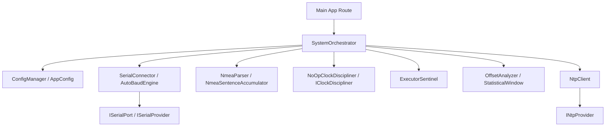

# System Context: qtr-qth

`qtr-qth` is a high-fidelity, GPS-disciplined time and location synchronization hub designed for amateur radio applications. The project provides Stratum 0 time precision (QTR) and high-accuracy Maidenhead Grid Square (QTH) calculation.

---

## 1. Ubiquitous Language & Domain Glossary

*   **QTR**: The time-sync domain. Represents the process of query, parsing, and disciplines of the system clock relative to Stratum 0 GPS time.
*   **QTH**: The location domain. Refers to latitude, longitude, and the calculated 6-character Maidenhead Grid Square locator (e.g., `FN20is`).
*   **Sentinel**: The self-healing connection monitor. An active background thread that detects serial stream interrupts and automatically cycles virtual or physical TTY connections.
*   **Baud Discovery**: The auto-negotiation engine. Scans serial ports across standard baud frequencies to identify and latch onto active NMEA streams.
*   **Precision Metrics**: Statistical window analyzer. Accumulates time offsets between local GPS readings and NTP servers to discipline the system clock.
*   **Telemetry Pulse**: Immutable domain record of a parsed NMEA sentence containing timestamp, coordinates, sat count, and calculated time offset.

---

## 2. Architectural Blueprint

The application follows a strict **Directed Acyclic Graph (DAG)** module dependency structure. Zero circular package dependencies are tolerated.



### Architectural Principles:
1.  **Declarative & Functional Pipelines**: Prefer immutability and monadic container flows (`io.vavr.control.Try`, `io.vavr.control.Option`) over null checks and imperative try-catch blocks.
2.  **Zero-Overhead Observability**: All runtime telemetry must go through structured loggers (`org.slf4j.Logger`). Direct standard out/error operations (`System.out.println`, `printStackTrace()`) are prohibited except within interactive CLI tools like `HardwareProbe` and `EnvironmentDoctor`.
3.  **Minimal Dependency Surface**: Core logic relies strictly on JDK 21 standard library features and the functional Vavr ecosystem. External libraries are restricted to low-level hardware serial interfaces (`jSerialComm`) and network time protocols (`commons-net`).

---

## 3. Developer Workflows

*   **Behavior-Driven Development**: Maintain tests using explicit **Given-When-Then** acceptance criteria mappings.
*   **Local Containerized CI**: To prevent CI runner costs, verify code quality and security scans locally using:
    ```bash
    ./scripts/local-ci.sh --all
    ```
    This invokes Gitleaks, Trivy, Super-Linter, and CodeQL inside Docker containers.
