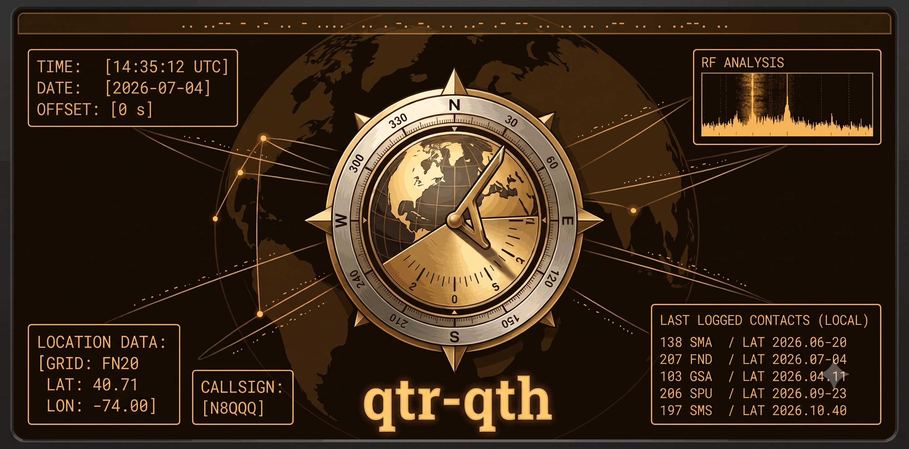

# qtr-qth



`qtr-qth` is a high-fidelity, GPS-disciplined time and location synchronization hub designed specifically for amateur radio applications. The engine provides Stratum 0 time precision (**QTR**) and high-accuracy Maidenhead Grid Square (**QTH**) calculations.

---

## 📡 Core Capabilities

*   **QTR (Time Synchronization)**: Connects to a serial GPS/GNSS receiver to query, parse, and discipline the local system clock relative to Stratum 0 GPS atomic time.
*   **QTH (Maidenhead Grid Square)**: Parses NMEA location coordinates (latitude and longitude) and translates them on-the-fly into a precise 6-character Maidenhead Grid Locator (e.g., `FN20is`).
*   **Stream Sentinel**: An active, self-healing background monitor that detects connection drops or serial interrupts and automatically restarts or hot-swaps TTY connections.
*   **Auto-Baud Discovery**: Scans and negotiates connection frequencies across standard baud rates to automatically latch onto active GPS receiver streams.
*   **Precision Metrics**: Analyzes local clock drift and offset statistics relative to NTP servers to track jitter and frequency stability.

---

## 🚀 Operator Guide

No global Gradle installation is required. `qtr-qth` uses pre-configured wrappers (`gradlew` and `gradlew.bat`) to download dependencies and run automatically.

### Windows Setup & Execution
1.  **Install Java**: Ensure you have **Java 21** (or higher) installed. Download it from the [Eclipse Temurin OpenJDK Installer](https://adoptium.net/temurin/releases/?version=21).
2.  **Identify GPS Port**: Connect your USB GPS receiver, open **PowerShell** in this folder, and run:
    ```powershell
    .\gradlew.bat --probe
    ```
    This scans your system COM ports and recommends the most likely GPS receiver target.
3.  **Run the Sync Engine**:
    ```powershell
    .\gradlew.bat qtr-qth.properties
    ```

### Linux Setup & Execution
1.  **Configure Permissions**: USB serial ports require group access. Run our helper script to automatically add your user account to the correct permissions group:
    ```bash
    chmod +x src/main/dist/scripts/linux-setup.sh
    ./src/main/dist/scripts/linux-setup.sh
    ```
    *Note: You must log out and log back in (or restart) for group permissions to apply.*
2.  **Identify GPS Port**:
    ```bash
    ./gradlew --probe
    ```
3.  **Run the Sync Engine**:
    ```bash
    ./gradlew qtr-qth.properties
    ```

---

## 🩺 System Diagnostics (The Doctor)

If the synchronizer fails to start, lacks network access, or cannot locate your GPS receiver, run the interactive environment diagnostic tool:

*   **Windows**: `.\gradlew.bat --doctor`
*   **Linux**: `./gradlew --doctor`

The Doctor will scan your system's Java version, local serial permissions, NTP network reachability, and source code integrity, presenting copy-pasteable **rescue commands** to resolve any identified issues.

---

## ⚙️ Configuration Properties

All settings are managed inside `qtr-qth.properties`. You can open this file in any text editor:

| Parameter | Default | Description |
| :--- | :--- | :--- |
| `simulation.mode` | `false` | Set to `true` to run the engine in simulation fallback mode (no physical GPS required). |
| `gps.discovery.keywords` | `gps,u-blox,prolific,...` | Keywords used by the auto-baud engine to find your GPS port. |
| `ntp.server` | `pool.ntp.org,...` | List of NTP servers to query for clock drift analysis. |
| `serial.baud` | `9600` | Fallback baud rate if auto-discovery fails. |
| `display.raw.telemetry` | `false` | Set to `true` to print raw NMEA sentences on the terminal screen. |

### Offline/Indoor Simulation Mode
If you are testing the software indoors without a satellite lock or do not have physical hardware connected, you can force the application to use a high-fidelity GPS simulator:
1.  Open `qtr-qth.properties`.
2.  Change `simulation.mode=false` to `simulation.mode=true`.
3.  Run the application. The system will start using the mock NMEA dataset in `simulation/gps_sim.nmea`.

---

## 💻 Web Dashboard Preview

While the core synchronizer runs as a lightweight terminal application, a standalone client-side prototype of the future web dashboard is hosted on **GitHub Pages**:

🔗 **[Launch Web Dashboard Prototype](https://N8QQQ.github.io/qtr-qth/)**

You can use this interactive interface to visualize the NMEA telemetry stream, watch the connection Sentinel cycle during simulated hardware dropouts, and view calculated grid coordinates.

---

## 📖 Developer Guide

For instructions on compiling the source, running the behavior-driven test suite, or executing local security scans, refer to the **[Developer Workflows](file:///home/nicholas/src/qtr-qth/docs/DEVELOPER.md)** document.
