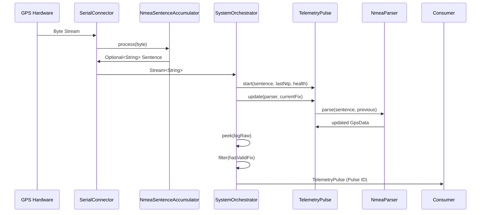

# Developer Documentation: qtr-qth

This document outlines the technical environment, build workflows, and high-fidelity virtualization protocols for the `qtr-qth` project.

## 🏗️ Technical Architecture
For details on the functional pipeline, concurrency model, and system design, refer to the **[System Architecture (ARCHITECTURE.md)](architecture/ARCHITECTURE.md)**.

### The Pulse Lifecycle (Sequence View)
The following diagram traces a single NMEA sentence from the hardware edge through its transformation into a high-fidelity telemetry pulse.

## 🛠️ Development Workflow

### Prerequisites
- **Java:** JDK 21 LTS (Eclipse Temurin preferred).
- **Docker & Docker Compose:** Required for virtualization and CI mirroring.
- **Gradle:** 9.3.0 (Utilized via the included `./gradlew` wrapper).

### Local Execution (Host)
- `./gradlew run`: Start the application.
- `./gradlew installDist`: Create unzipped distribution in `build/install/qtr-qth/`.
- `./gradlew test`: Execute the BDD and unit test suites.
- `./gradlew probeHardware`: Scans the host system for physical/virtual GPS serial hardware.

## 🤖 AI-Integrated Development
This project follows an **AI-first workflow** (Nicholas R. Ustick + JARVIS). All refactoring must follow the **"Heritage Grade"** standard: Zero mutable logic in core components and strictly decoupled hardware abstractions as defined in [`GEMINI.md`](GEMINI.md).

---
## 🛰️ Infrastructure Ecosystem (Docker)
To ensure high-fidelity development and cross-platform parity, `qtr-qth` utilizes a multi-container orchestration strategy. This eliminates "It works on my machine" syndromes and allows for deterministic hardware testing.

### Container Catalog & Utility

| Service | Role | Key Capability | Resource Envelope |
| :--- | :--- | :--- | :--- |
| **`ci`** | Quality Gate | Headless compilation, linting, and testing. | Native Host |
| **`docs`** | Staging Hub | Real-time preview of the Jekyll-based manual. | 512MB RAM |
| **`phantom`** | Virtual Shack | Hardware spoofing via `socat` and TCP bridges. | 1.0 CPU / 1GB RAM |
| **`stress-test`** | ARM64 Mirror | Emulated ARM64 execution to certify Pi-parity. | 0.5 CPU / 512MB RAM |

---

### 🛠️ Detailed Service Breakdown

#### 1. The Quality Gate (`ci`)
- **Usage:** `docker-compose run --rm ci`
- **Purpose:** Mirrors the GitHub Actions environment (Ubuntu 24.04 + JDK 21). It executes a full "Clean-Check-Test" cycle, producing the final distribution ZIP.
- **Developer Benefit:** Ensures that your local changes will pass the remote CI pipeline before you push.

#### 2. The Phantom Shack (`phantom`)
- **Usage:** `docker-compose run --rm phantom`
- **Purpose:** A high-fidelity laboratory for hardware logic.
    - **Hardware Spoofing:** Creates a virtual serial device at `/dev/ttyUSB99`.
    - **TCP Bridge:** Listens on port `9999`. Any data sent to this port from the host is piped directly into the virtual GPS device inside the container.
    - **Static Seeding:** If `SIM_MODE=true` (default), it loops `gps_sim.nmea` into the TTY automatically.
- **Developer Benefit:** Allows testing of "Signal Loss" and "Recovery" logic without physically unplugging a GPS receiver.

#### 3. The Stress Tester (`stress-test`)
- **Usage:** `docker-compose run --rm stress-test`
- **Purpose:** Utilizes QEMU emulation to run the application on a native `linux/arm64` platform.
- **Developer Benefit:** Certifies that Nio-based pathing and floating-point math behave identically on a Raspberry Pi, even when developed on Windows or Intel-based Linux.

---
## 🔍 Debugging & Troubleshooting
Given the hardware-dependent nature of `qtr-qth`, debugging often requires looking beyond the Java stack into the OS kernel and virtualized pipes.

### 1. Serial Hardware Diagnostics
If the application fails to identify your GPS receiver:
- **Run the Probe:** Use `./gradlew probeHardware` to see exactly what the OS reports.
- **Permission Check (Linux):** Ensure your user is in the `dialout` group: `sudo usermod -a -G dialout $USER`.
- **Lock Contention:** Ensure no other tool (e.g., GPSD, Minicom, PuTTY) is holding the port open.

### 2. Virtualization & Phantom Shack Issues
If the `phantom` container behaves unexpectedly:
- **Stale TTY Handles:** If `socat` fails to create `/dev/ttyUSB99`, ensure a previous container didn't leave a ghost handle. Run `docker-compose down` to purge the network and orphans.
- **Live Stream Verification:** To verify the TCP bridge, send a manual sentence from your host: 
  `echo "$GPZDA,123456,01,01,2026,00,00*6C" | nc localhost 9999`
- **Architecture Mismatch:** If `stress-test` fails to start, verify that Docker Desktop has **QEMU support** enabled for ARM64 emulation.

### 3. Telemetry Pulse Analysis
The system utilizes **Mapped Diagnostic Context (MDC)** to track data through the pipeline.
- **Pulse ID Tracking:** Every log line is prefixed with a 4-digit Hex ID (e.g., `[B026]`). Use this to correlate raw NMEA ingestion with final parsed results.
- **Health Signaling:** Check the `[GPS: Status | NTP: Status]` prefix in the logs.
    - `RECOVERY`: System is re-scanning for hardware after signal loss.
    - `ACTIVE`: The "River" is flowing normally.
- **Raw Telemetry:** Enable `display.raw.telemetry=true` in `config/boot.properties` to see the unprocessed byte-stream in the logs.

---
## 🚀 Heritage Release Protocol

Every release must follow this high-fidelity sequence:

### 1. Pre-Release Metadata Sync
- [ ] Bump version in `build.gradle.kts`.
- [ ] Update `version` and `date-released` in `CITATION.cff`.
- [ ] **Roadmap Alignment:** Synchronize `PLAN.md` with the current tactical state.

### 2. Logic & Security Certification (DoD)
- [ ] **Test Pass:** Run `docker-compose run --rm ci`. **All tests must be green.**
- [ ] **OWASP 2025 Audit:** Manual/Static scan for Supply Chain and Integrity vulnerabilities.

### 3. Distribution & Archival
- [ ] **Artifact Generation:** Run `./gradlew distZip`.
- [ ] **Verification:** Confirm signed git tag `v[version]` and attach ZIP to the GitHub Release.
- [ ] **Scholarly Sync:** Ensure Zenodo DOI metadata (Affiliation, Keywords) matches the repo.

---
*For end-user instructions, see [README.md](README.md).*.
