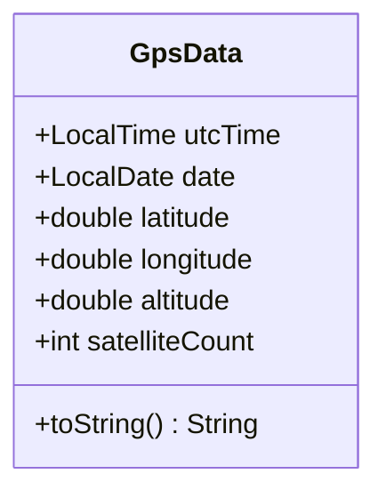
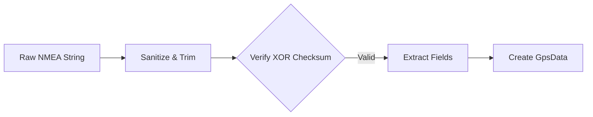

# Technical Design: Phase 1 - Foundation (v0.1.0)

## 🎯 Objective
Establish the high-precision data structures and foundational parsing logic for GPS telemetry.

## 🏗️ Architectural Components

### 1. GPS Data Records (`com.stoicprogrammer.qtrqth.nmea.GpsData`)
An immutable Java `record` designed to carry high-fidelity position and time metadata.

### 2. Basic NMEA Parsing (`com.stoicprogrammer.qtrqth.nmea.NmeaParser`)
Pure functional transformation of raw NMEA strings into `GpsData` records.

### 3. Maidenhead Grid Calculation (`com.stoicprogrammer.qtrqth.util.GridSquareCalculator`)
Mathematical utility to transform coordinates into 6-character Maidenhead locators (e.g., EN66gl).

## 🧪 Verification Strategy
- **Unit Tests:** Verify XOR checksum logic against known-good NMEA sentences.
- **Precision:** Assert that Grid Square calculations match reference coordinates (Ishpeming, London, Sydney).
