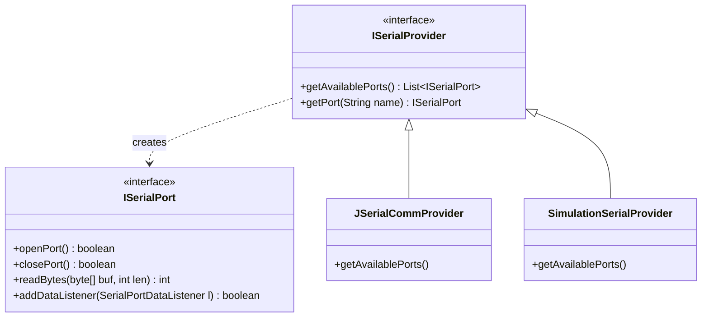
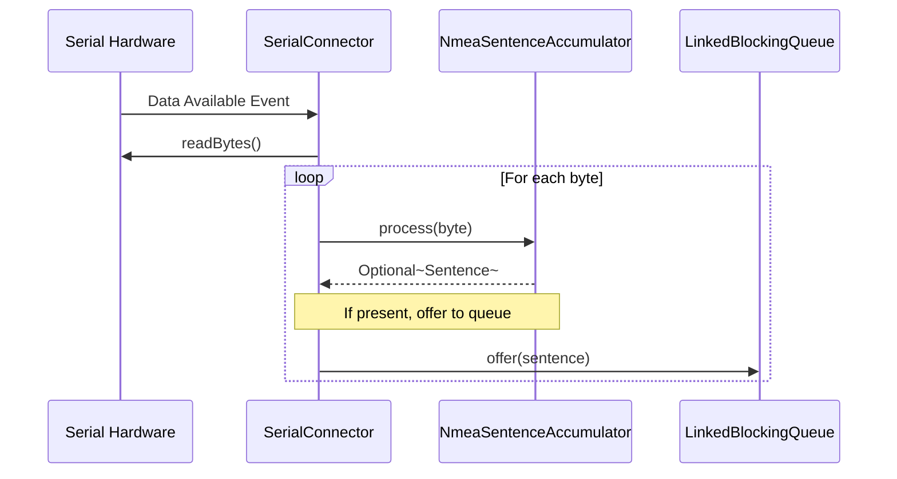

# Technical Design: Phase 2 - Serial Plumbing (v0.2.0)

## 🎯 Objective
Implement a robust, decoupled hardware abstraction layer for serial communication and establish a multi-threaded data ingestion pipeline.

## 🏗️ Architectural Components

### 1. Serial HAL (`com.stoicprogrammer.qtrqth.serial.api`)
A Hardware Abstraction Layer that decouples the application from physical JNI dependencies.

### 2. The Ingestion Pipeline
Asynchronous byte-to-sentence accumulation to prevent UI/Pipeline blocking.

### 3. Port Auto-Discovery
Heuristic-based scanning to identify likely GPS hardware based on manufacturer metadata (u-blox, Prolific, etc.).

## 🧪 Verification Strategy
- **BDD Integration:** Verify that simulated hardware generates valid NMEA streams.
- **Resilience:** Assert that malformed bytes are handled by the accumulator without losing subsequent sentence synchronization.
