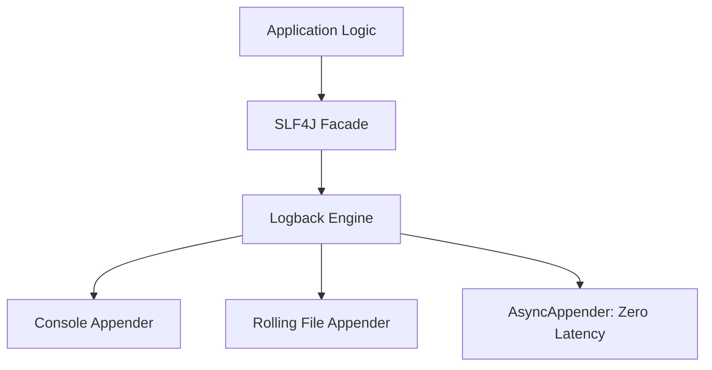
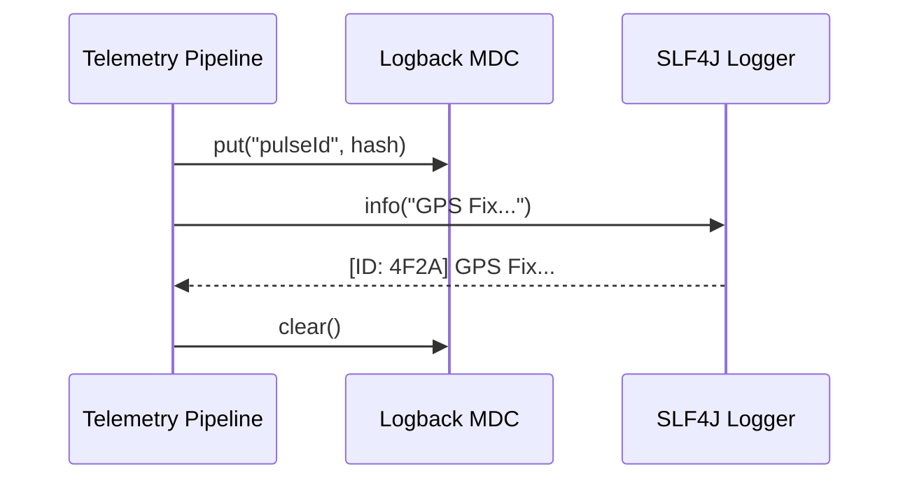

# Technical Design: Phase 3 - Observability (v0.2.0)

## 🎯 Objective
Establish a professional logging infrastructure and implement per-pulse traceability across asynchronous boundaries.

## 🏗️ Architectural Components

### 1. Unified Logging Strategy (SLF4J/Logback)
Dual-stream logging to separate business telemetry ("Shack Log") from internal debugging ("Lab Log").

### 2. Mapped Diagnostic Context (MDC)
Injecting unique **Pulse IDs** into the thread context to ensure logs from different rivers (Fast/Slow) can be correlated.

## 🧪 Verification Strategy
- **Context Traceability:** Assert that every log entry during a pulse contains the correct 4-character hex ID.
- **Performance:** Verify that async logging does not block the 1Hz hardware ingestion river.
