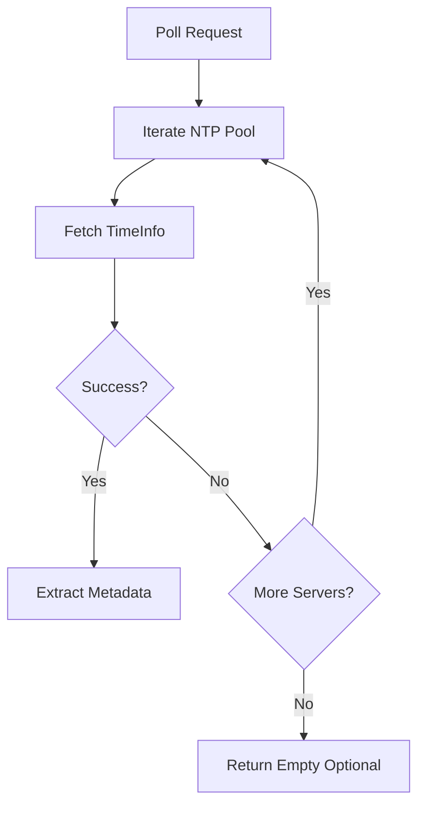
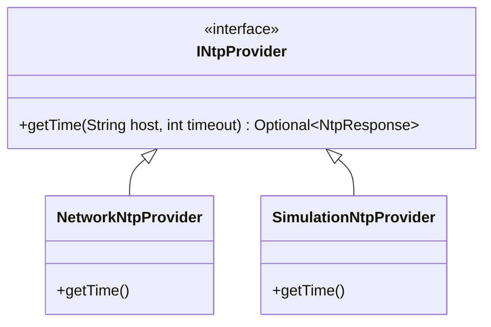

# Technical Design: Phase 4 - Network Time Reference (v0.3.0)

## 🎯 Objective
Establish a high-precision network time baseline (NTP) to serve as a secondary authority for drift comparison.

## 🏗️ Architectural Components

### 1. NTP Client (`com.stoicprogrammer.qtrqth.ntp.NtpClient`)
A resilient client capable of polling pools of Stratum 1/2 servers with automated fallback.

### 2. The NTP HAL (`com.stoicprogrammer.qtrqth.ntp.api.INtpProvider`)
Decoupling the transport layer (Apache Commons Net) to allow 100% hermetic CI testing.

### 3. Precision Metadata
Capturing Round Trip Time (RTT), Stratum, and Root Dispersion to quantify the "Authority" of the network reference.

## 🧪 Verification Strategy
- **CI Stabilization:** Assert that NTP tests pass in headless GitHub environments without live network access.
- **Metadata Integrity:** Verify that RTT and Stratum are correctly mapped from the `TimeInfo` message.
