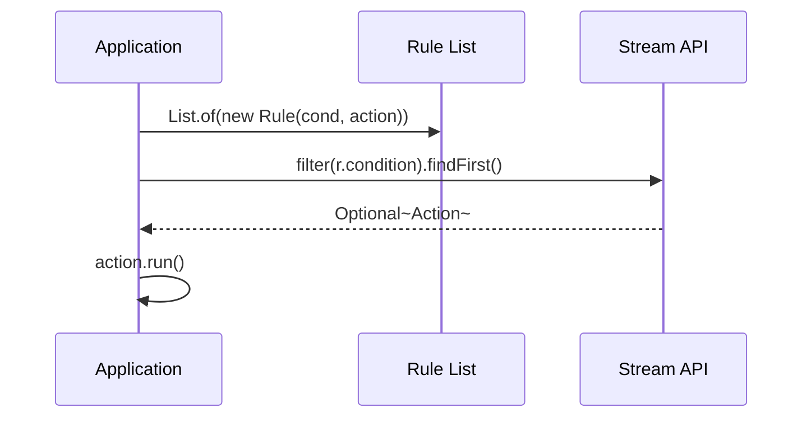

# Technical Design: Phase 5 - The Functional Blueprint (v0.4.0)

## 🎯 Objective
Codify the branchless functional paradigm and automate architectural standards via a "Bulletproof" linter.

## 🏗️ Architectural Components

### 1. Logic as Data (Declarative Routing)
Eliminating the `switch` statement by mapping sentence types to functional BiFunctions.

### 2. The Rule Engine Pattern
Replacing complex `if/else` chains with a Stream-processed `List` of Predicate-Supplier rules.

### 3. Automated Quality Gate (Checkstyle)
Enforcement of "Strict Finality" and a "Global Loop Ban" at the build level.

## 🧪 Verification Strategy
- **Linter Certification:** The build must fail if any `for`, `while`, or non-final local variable is detected in the production source.
- **Behavioral Assertions:** All tests refactored to use **AssertJ** for fluent, functional verification.
