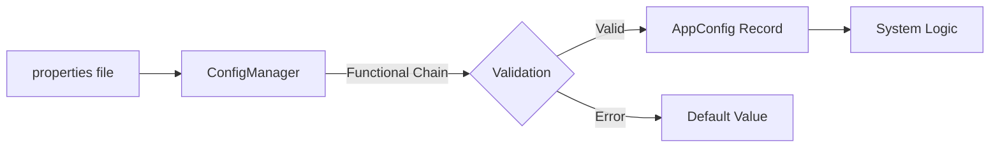
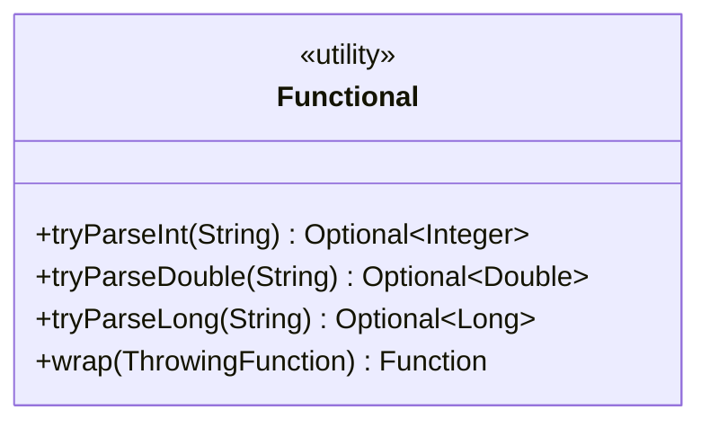
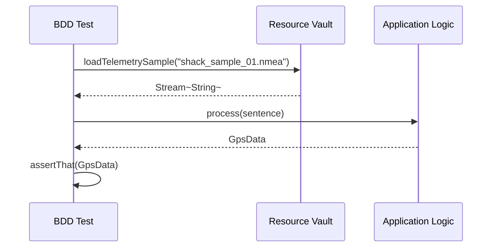

# Technical Design: Phase 6 - Structural Hardening (v0.4.1)

## 🎯 Objective
Final polish and reinforcement of the functional baseline. Shield the core logic from hardware volatility and eliminate "Stringly-Typed" vulnerabilities.

## 🏗️ Architectural Components

### 1. Typed Configuration (`com.stoicprogrammer.qtrqth.config`)
Eliminating raw string lookups by parsing properties into high-fidelity records at the application edge.

### 2. Numeric Purity (`com.stoicprogrammer.qtrqth.util.Functional`)
Standardized monadic wrappers using Vavr's `Try` to safely ingest raw numeric data from serial/NTP sources.

### 3. The Test Data Vault (`src/test/resources/telemetry`)
Externalizing raw NMEA samples to decouple behavioral verification from the source code.

## 🧪 Verification Strategy
- **Performance Certification (JMH):** Using microbenchmarks to prove that Vavr's functional overhead is negligible (< 5ns per op).
- **Supply Chain Grounding:** Hardening `verification-metadata.xml` to include multi-platform artifact checksums.
- **Linter Certification:** 100% compliance with the "Magic Number Elimination" mandate.
