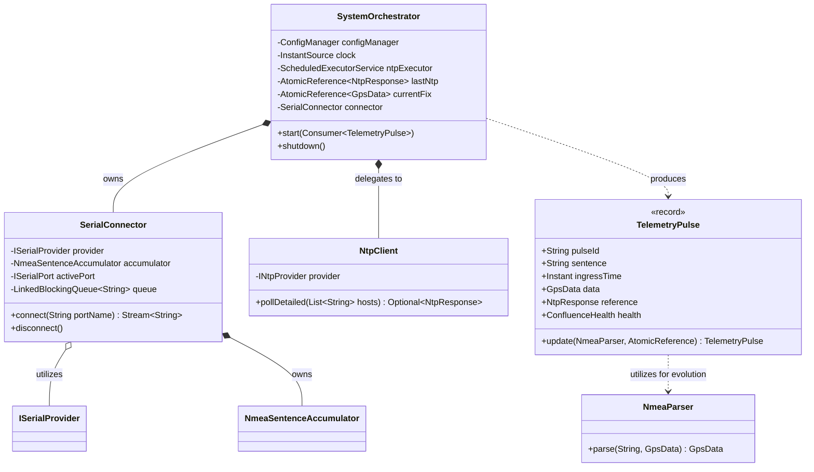
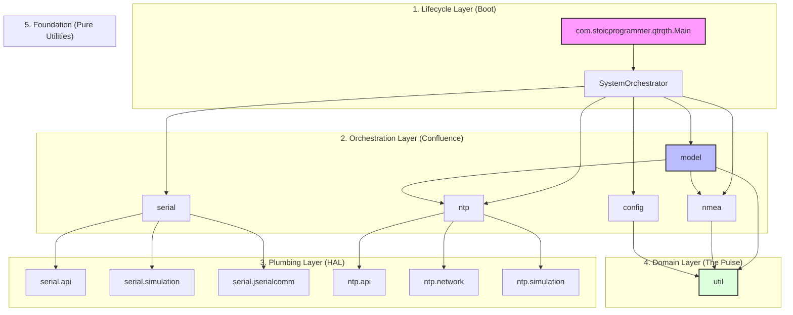
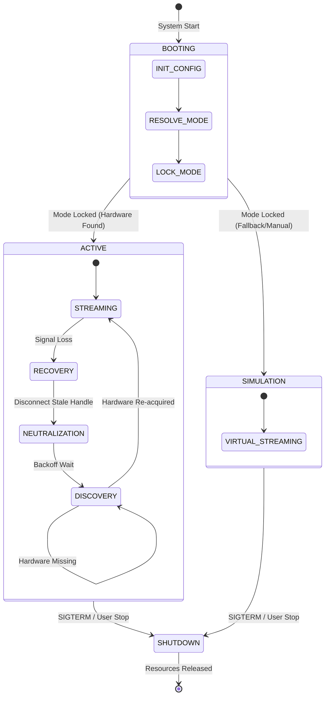
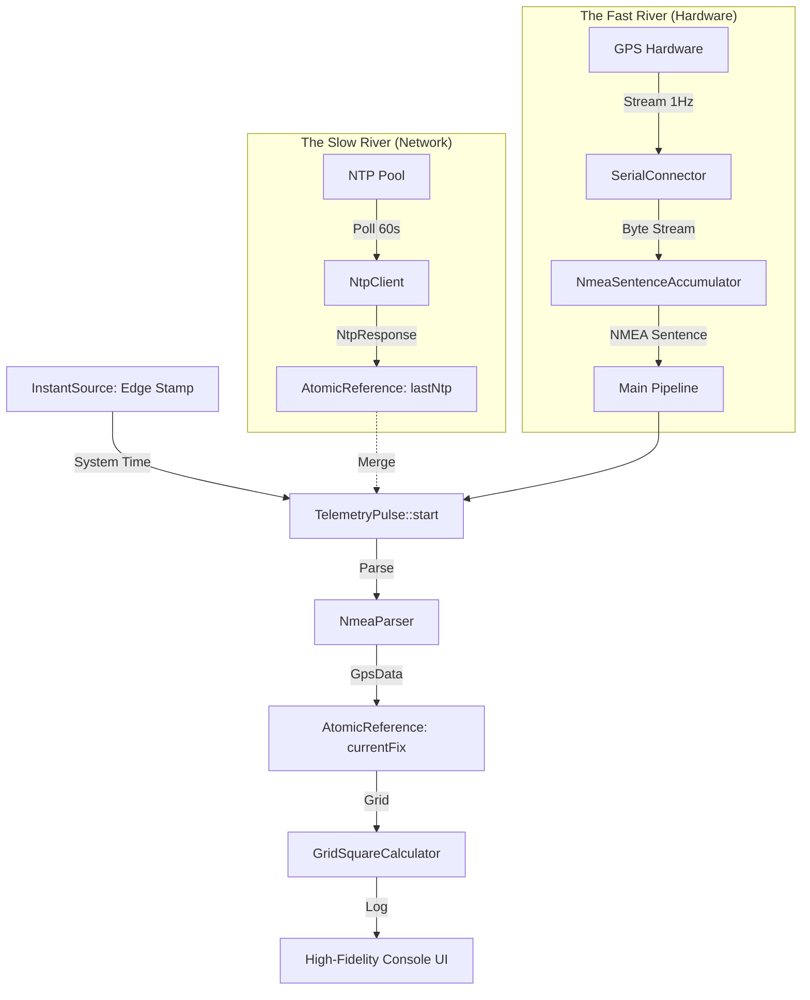

# System Architecture: qtr-qth

`qtr-qth` is a high-precision, event-driven telemetry hub. The architecture prioritizes functional purity, thread-safety, and high-fidelity observability through a strictly decoupled Hardware Abstraction Layer (HAL).

## 🏛️ Component Blueprint (Structural View)
The system is organized into decoupled functional blocks. The `SystemOrchestrator` serves as the primary lifecycle manager, coordinating the interaction between data providers and the telemetry pipeline.

## 📐 Package Hierarchy & Dependency Graph (Structural Purity)
The system enforces a strict **Top-Down Unidirectional Flow**. My audit of the `v0.6.0` codebase certifies **Zero Circular Dependencies**.

### 🛡️ Dependency Mandates:
1.  **Acyclic Flow:** No package in a lower layer may depend on a higher layer.
2.  **Domain Purity:** The `model` and `nmea` packages must remain free of OS-level side effects (I/O, Clocks, Network).
3.  **Monadic Foundation:** The `util` package provides the functional primitives used by all layers for safe parsing and exception handling.

## 🔄 System Lifecycle (Behavioral View)
The application operates as a deterministic state machine. The transition from `BOOTING` to `ACTIVE` involves a "State-Lock" where the operational mode is committed and never changed.

## 📡 The "Two-River Confluence" Model (Data Flow)
The core of the system is based on two asynchronous streams of data merging into a unified telemetry pulse.

1.  **The Slow River (NTP):** A background heartbeat that polls network time servers to provide a reliable "second opinion" on time drift.
2.  **The Fast River (GPS):** A high-frequency stream of NMEA sentences direct from hardware, providing Stratum 0 precision.
3.  **The Confluence:** Every time a GPS sentence arrives, it captures the latest known NTP reference to create a `TelemetryPulse`, ensuring end-to-end traceability.

## 🛡️ Structural Guardrails
- **Typed Configuration:** Immutable `AppConfig` records eliminate "Stringly-Typed" logic.
- **Numeric Purity:** Monadic wrappers (`tryParseInt`) catch hardware noise.
- **State-Lock:** Boot-time determination of HARDWARE vs SIMULATION modes ensures runtime stability.

---
*For historical tactical details, see the [Phase Designs](../design/DESIGN_PHASE_1.md).*
