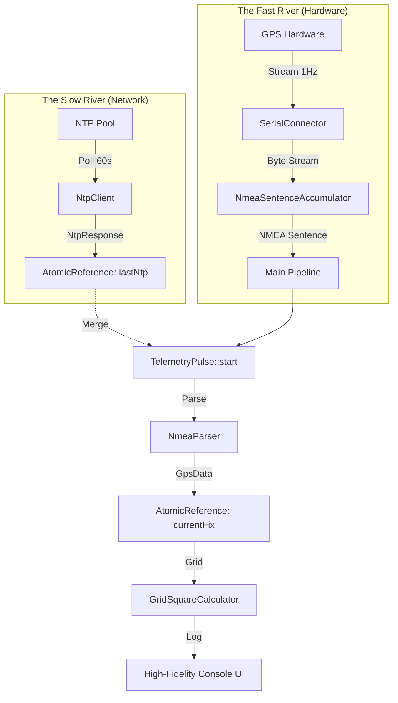
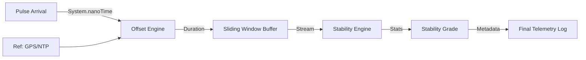

# System Architecture: qtr-qth

`qtr-qth` is designed as a high-precision, event-driven telemetry hub. The architecture prioritizes functional purity, thread-safety, and observability.

## 🏛️ The "Two-River Confluence" Model

The core of the system is based on two asynchronous streams of data merging into a unified telemetry pulse.

1.  **The Slow River (NTP):** A background heartbeat that polls high-stratum network time servers every 60 seconds to provide a reliable "second opinion" on time drift.
2.  **The Fast River (GPS):** A high-frequency stream of NMEA sentences direct from the serial hardware, providing Stratum 0 precision and location context.
3.  **The Confluence:** Every time a GPS sentence arrives, it captures the latest known NTP reference to create a `TelemetryPulse`, ensuring end-to-end traceability across threads.

## 📡 Authority & Stratum
By directly connecting to GPS (Stratum 0), `qtr-qth` effectively operates as a **Stratum 1** authority for the local shack, using NTP as a "Second Opinion" for drift verification.

## 🛡️ Structural Hardening (Phase 6)
To ensure the integrity of the confluence, the system implements strict structural guardrails:

1.  **Typed Configuration:** All system parameters are parsed at the edge into immutable `AppConfig` records, eliminating "Stringly-Typed" logic.
2.  **Numeric Purity:** Standardized monadic wrappers (`tryParseInt`, `tryParseDouble`) catch hardware noise and malformed telemetry before they reach the core logic.
3.  **The Test Vault:** High-fidelity NMEA samples are externalized to ensure that the parsing engine is certified against real-world radio shack data.

## 📉 Drift & Stability Analysis (Future Phase 9)
Once the foundation is hardened, the system will implement an analytical pipeline to quantify system clock accuracy:

1.  **Differential Calculus:** Calculating the high-precision delta between `Local Clock` and `Reference Clock`.
2.  **Statistical Smoothing:** Using a Sliding Window Buffer to calculate jitter (standard deviation) and drift trends.

---
*For historical tactical details, see the [Phase Designs](../design/DESIGN_PHASE_1.md).*
