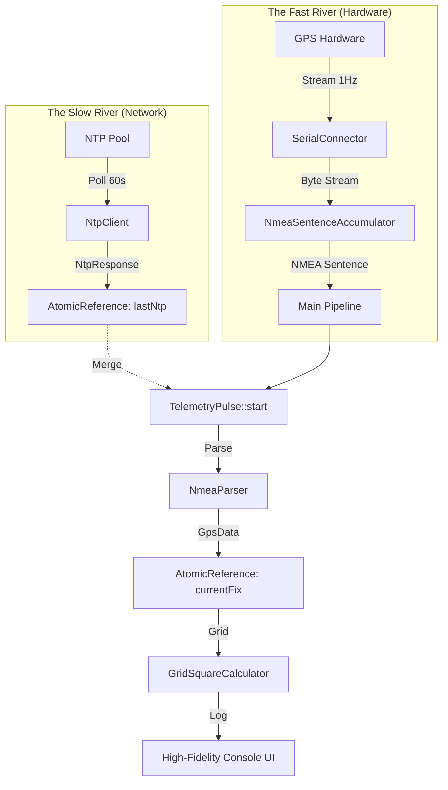
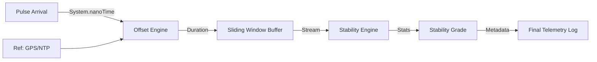

# System Architecture: qtr-qth

`qtr-qth` is designed as a high-precision, event-driven telemetry hub. The architecture prioritizes functional purity, thread-safety, and observability.

## 🏛️ The "Two-River Confluence" Model

The core of the system is based on two asynchronous streams of data merging into a unified telemetry pulse.

1.  **The Slow River (NTP):** A background heartbeat that polls high-stratum network time servers every 60 seconds to provide a reliable "second opinion" on time drift.
2.  **The Fast River (GPS):** A high-frequency stream of NMEA sentences direct from the serial hardware, providing Stratum 0 precision and location context.
3.  **The Confluence:** Every time a GPS sentence arrives, it captures the latest known NTP reference to create a `TelemetryPulse`, ensuring end-to-end traceability across threads.

## 📡 Authority & Stratum
By directly connecting to GPS (Stratum 0), `qtr-qth` effectively operates as a **Stratum 1** authority for the local shack, using NTP as a "Second Opinion" for drift verification.

## 📉 Stability & Drift Analysis (Phase 6)
To certify the precision of the system clock, the system implements a secondary analytical pipeline:

1.  **Differential Calculus:** The system calculates the high-precision delta between `Local Clock` and `Reference Clock` (GPS/NTP) at the exact moment of pulse arrival.
2.  **Statistical Smoothing:** Real-time offsets are stored in a **Sliding Window Buffer**, where we calculate the arithmetic mean and standard deviation (Jitter).
3.  **Heuristic Scoring:** A weighted heuristic is applied to the metadata (Stratum, RTT, Fix Quality) to assign a **Stability Grade** to the shack's time health.

---
*For historical tactical details, see the [Phase Designs](../design/DESIGN_PHASE_1.md).*
