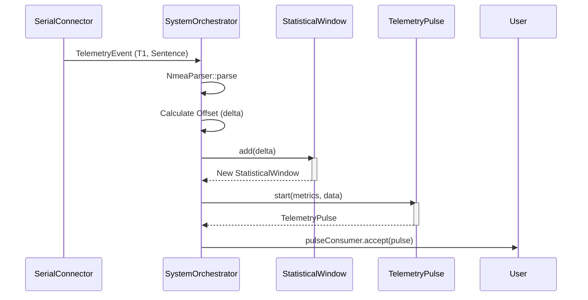
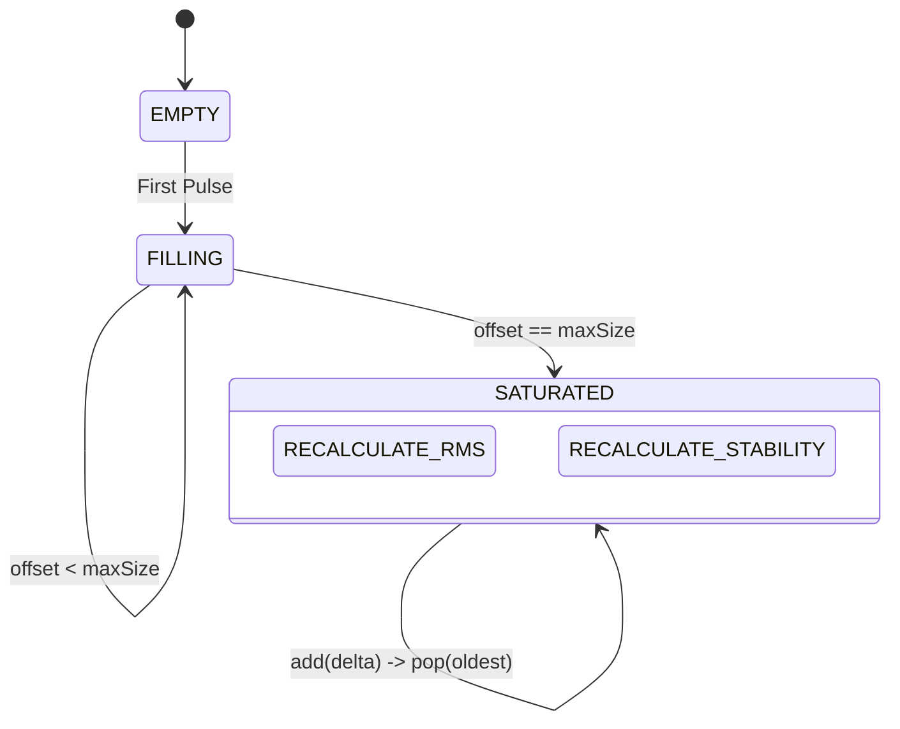

# Phase 10 Design: Precision Drift & Offset Analysis (v0.8.0)

**Objective:** Quantify the system clock's "Resolving Power" by calculating microsecond-level drift against authoritative GPS and NTP sources.

## 🏛️ Statistical Architecture

The **Offset Engine** operates as a functional transformation pipeline. It converts raw temporal ingress events into a high-fidelity statistical matrix.

### 1. Mathematical Definitions

We define the following metrics to evaluate the host OS clock stability:

#### A. Temporal Offset ($\delta$)
The instantaneous error between the System Clock ($T_{sys}$) and the GPS Atomic Clock ($T_{gps}$).
$$\delta = T_{sys} - T_{gps}$$

#### B. RMS Jitter ($\sigma_{rms}$)
The Root Mean Square error over a sliding window ($N$) of offsets. This represents the total noise (accuracy + precision).
$$\sigma_{rms} = \sqrt{\frac{1}{N} \sum_{i=1}^{N} \delta_i^2}$$

#### C. Stability ($S$)
The Standard Deviation of the offset over the window. This represents the "precision" or "cadence consistency," independent of the absolute offset.
$$S = \sqrt{\frac{1}{N} \sum_{i=1}^{N} (\delta_i - \bar{\delta})^2}$$

### 2. Interaction Model

The `StatisticalWindow` is a persistent immutable structure within the `SystemOrchestrator`.



### 2.1 The Heartbeat Sentinel (Pluggable Strategy)
To maintain a continuous `Stream<TelemetryEvent>` during signal loss without tearing down the connection, the system utilizes a pluggable `IStreamSentinel` interface. 

To satisfy the Raspberry Pi thermal and CPU-efficiency constraints, we implement the **`ExecutorSentinel`** strategy:
- **Borrowed Executor:** Reuses the `SystemOrchestrator`'s existing `ScheduledExecutorService` to prevent thread sprawl.
- **Daemon Guardrails:** Threads are explicitly flagged as daemons to prevent zombie processes on shutdown.
- **Lock-Free Concurrency:** Utilizes an `AtomicReference<Instant>` for concurrent, non-blocking timestamp monitoring between the ingestion stream and the watchdog.
- **Graceful Cancellation:** The sentinel holds a `ScheduledFuture<?>` and actively cancels the watchdog task upon `SerialConnector` neutralization.

### 3. Data Model Evolution: The Signal Matrix

To provide context for timing drift, the `TelemetryPulse` is enriched with signal-quality records.

#### SatelliteFix (Record)
- `prn`: Satellite ID.
- `snr`: Signal-to-Noise Ratio (dB-Hz).
- `azimuth`/`elevation`: Sky position.

#### PrecisionMetrics (Record)
- `systemOffset`: Microseconds.
- `rmsJitter`: Windowed noise (Microseconds).
- `stability`: Windowed variance (Microseconds).

## 🔄 State Flow: The Sliding Window



## 🛠️ Usage in SystemOrchestrator

The orchestrator maintains the window state using an `AtomicReference`:

```java
// Inside runPipeline loop
final Duration offset = OffsetAnalyzer.calculateOffset(ingress, gpsTime);
final StatisticalWindow nextWindow = statsWindow.updateAndGet(w -> w.add(offset));

final PrecisionMetrics metrics = new PrecisionMetrics(
    offset,
    nextWindow.rmsJitterMicroseconds(),
    nextWindow.stabilityMicroseconds()
);
```

## 📚 References & Academic Grounding

The **Offset Engine** algorithms are derived from established temporal synchronization and clock discipline research:

1.  **Mills, D. L. (1991).** *Internet Time Synchronization: The Network Time Protocol.* IEEE Transactions on Communications. [IEEE Xplore](https://ieeexplore.ieee.org/document/103043) (Foundational theory for jitter vs. wander).
2.  **RFC 5905.** *Network Time Protocol Version 4: Protocol and Algorithms Specification.* [IETF Datatracker](https://datatracker.ietf.org/doc/html/rfc5905) (Specifically Appendix A.5.5 for clock filter and selection algorithms).
3.  **u-blox M9 Interface Description.** *UBX-18010854.* [u-blox Documentation](https://www.u-blox.com/en/docs/UBX-18010854) (Interpretation of GSV SNR values and GSA Dilution of Precision metrics).
4.  **IEEE 1588-2019.** *Standard for a Precision Clock Synchronization Protocol for Networked Measurement and Control Systems.* [IEEE Xplore](https://ieeexplore.ieee.org/document/9120315) (Understanding hardware-ingress timestamping).

## 🧮 Numerical Methodology

### 1. Library Selection
To maintain architectural purity and a lean dependency graph, we utilize **Java 21 Primitives + Vavr Collections** for statistical calculations. 

*   **Vavr `Vector`:** Provides $O(log_{32} n)$ effectively constant-time append and tail operations for the sliding window via a Bit-mapped Vector Trie. This ensures zero performance degradation as the window reaches saturation.
*   **Java `DoubleStream`:** Optimized for hardware-accelerated precision during aggregation.

### 2. Computational Efficiency (The Welford Option)
While the current window ($N=100$) is small enough for $O(N)$ recalculation on every pulse, future scaling or higher sample rates (e.g., 50Hz) will transition to **Welford's Algorithm** for $O(1)$ running variance and mean calculation to eliminate $O(N)$ jitter during the "Fast River" ingress.

### 3. Precision Guardrails
*   **Unit of Truth:** All internal temporal calculations are performed in **Nanoseconds** to prevent rounding errors before final conversion to **Microseconds** for the `PrecisionMetrics` record.
*   **Saturation Policy:** The window is "Warm-Started" only after $N_{min} = 10$ samples to prevent statistical outliers during bootstrapping.
