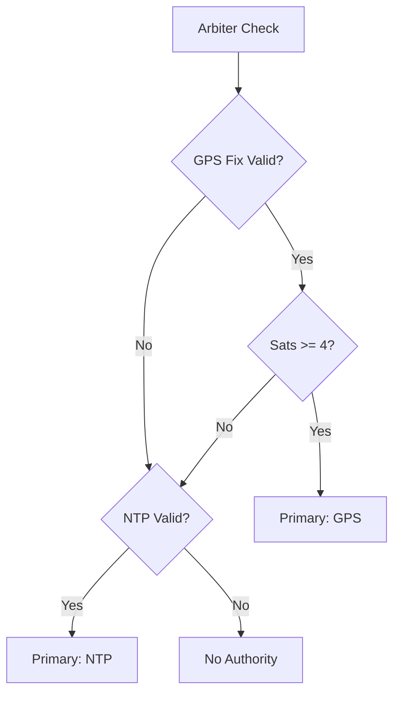
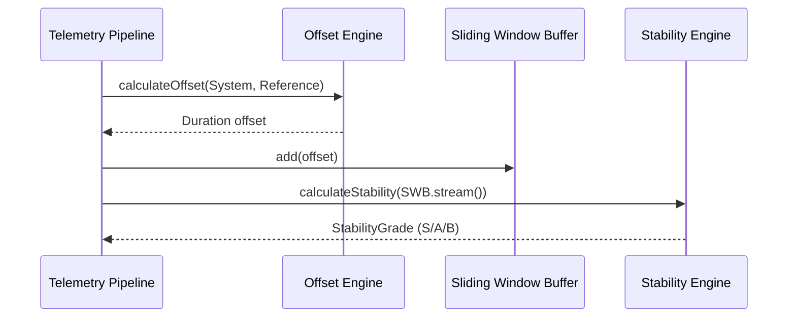

# Technical Design: Phase 6 - Jitter Bug (Drift & Offset Analysis)

## 🎯 Objective
To quantify the "Time Health" of the local system clock by calculating the differential between the system time and authoritative references (GPS/NTP), and analyzing the variance (jitter) over time.

## 🏗️ Architectural Components

### 1. The Offset Engine (`com.stoicprogrammer.qtrqth.drift.OffsetEngine`)
A functional component that calculates the delta between two `Instant` measurements.
- **Inputs:** `Instant systemTime`, `Instant referenceTime` (GPS or NTP).
- **Output:** `Duration offset`.
- **Constraint:** Must account for the "Snapshot Latency" (time taken from hardware interrupt to software capture).

### 2. The Reference Arbiter (`com.stoicprogrammer.qtrqth.drift.ReferenceArbiter`)
A logic component that decides which reference to trust based on metadata.
- **Rules:**
    - Prefer GPS if `satelliteCount >= 4` and `HDOP < 2.0`.
    - Fallback to NTP if GPS is invalid.
    - If both are available, use a weighted average or the one with lower reported dispersion.

### 3. Sliding Window Buffer (`com.stoicprogrammer.qtrqth.util.SlidingWindowBuffer<T>`)
A memory-efficient, thread-safe container for the last $N$ samples.
- **Size:** Default 60 samples (1 minute of telemetry).
- **Operations:** `add(T)`, `stream()`.

### 4. Stability Engine (`com.stoicprogrammer.qtrqth.drift.StabilityEngine`)
Calculates statistical metrics over the sliding window.
- **Mean Offset:** Arithmetic average of the buffer.
- **Jitter (Standard Deviation):** The variance of the offsets.
- **Shack-Grade Heuristic:**
    - **S-Grade (Heritage):** Offset < 5ms, Jitter < 1ms.
    - **A-Grade (Stable):** Offset < 20ms, Jitter < 5ms.
    - **B-Grade (Degraded):** Offset < 100ms, Jitter < 20ms.

## 📊 Data Records

### `DriftPulse`
Extends or wraps `TelemetryPulse` to include:
- `Duration offset`
- `Duration currentJitter`
- `StabilityGrade grade`

## 🧪 Testing Strategy (BDD)
- **Given** a window of 5 samples with known offsets.
- **When** calculating jitter.
- **Then** the result must match the expected standard deviation.

- **Given** a high-dispersion NTP reference and a high-fix GPS reference.
- **When** arbitrating.
- **Then** GPS must be selected as the primary authority.
