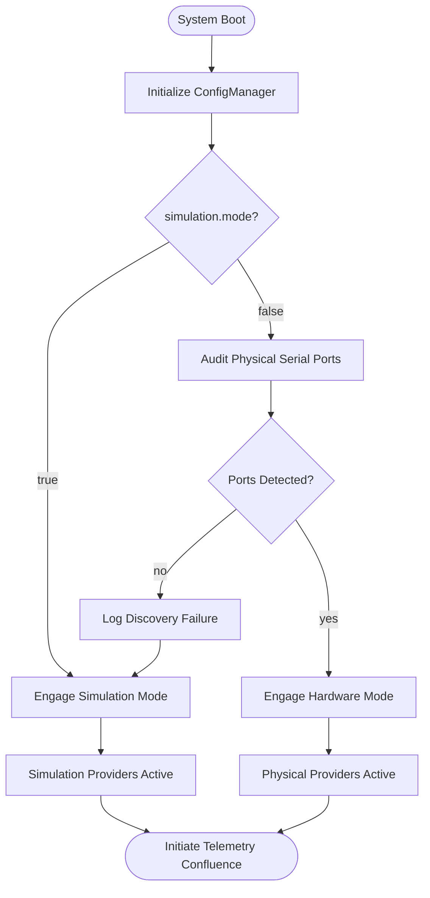
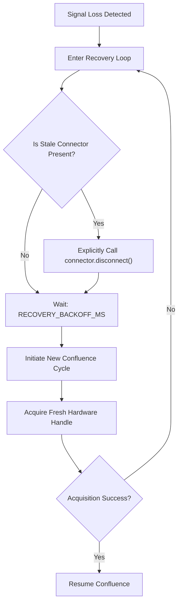

# Phase 7 Design: The Virtual Shack (v0.5.0)

**Objective:** Transition to a platform-agnostic development environment using Docker Compose, mirroring physical hardware and ARM64 architecture (Raspberry Pi) with high fidelity.

---

## 🏛️ Architectural Goals
1.  **Universal Orchestration:** Replace all `.ps1` and `.sh` scripts with `docker-compose.yml` to ensure identical developer workflows across Windows, Linux, and Mac.
2.  **The Mini-Lab (Phantom Shack):** A dedicated container providing a full development environment (JDK, Gradle, Serial Tools) with both virtual (socat) and physical hardware access.
3.  **Hardware Spoofing:** Utilize `socat` to create a virtual serial device (`/dev/ttyUSB99`) within the container for deterministic telemetry testing.
4.  **Architecture Parity:** Implement QEMU-based ARM64 emulation to certify Pi-compatibility locally.
5.  **Clean Repository Standards:** Move all infrastructure assets into an isolated `/docker` hierarchy.

---

## 🛠️ Tactical Components

### 7.1: Universal Command Center (`docker-compose.yml`)
- **Service: `ci`** - The Quality Gate (Testing, Linting, Artifacts).
- **Service: `docs`** - The Staging Hub (Jekyll Hub with p5.js flare).
- **Service: `phantom`** - The Virtual Shack (Interactive Dev Mirror + Hardware).
    - **Base OS:** Debian-slim (Raspbian Parity).
    - **Resource Hardening:** Enforce memory limits (e.g., 1GB) and CPU capping to simulate Raspberry Pi 4/5 hardware envelopes.

### 7.2: The Hardware Discovery Probe
- **Utility:** A standalone CLI tool built into the `serial` package.
- **Function:** Enumerate USB/Serial devices and apply fuzzy-matching logic to auto-identify physical GPS receivers.

### 7.3: Adaptive Hardware Fallback
- **Logic:** Refactor `SystemOrchestrator` to prioritize physical discovery while ensuring zero-crash continuity.
- **Process Flow:**
    1.  **Intent Check:** Read `simulation.mode` from configuration.
    2.  **Hardware Audit:** Regardless of intent, scan for available physical serial ports.
    3.  **Dynamic Selection:**
        -   If `simulation.mode=false` AND hardware is found: **Engage Hardware Path**.
        -   If `simulation.mode=false` AND NO hardware is found: **Log Warning & Engage Adaptive Fallback**.
        -   If `simulation.mode=true`: **Engage Simulation Path**.

#### Bootstrap State Machine


### 7.5: Live GPS Coordinator
- **Bridge:** Update the `phantom` entrypoint to support a TCP/UDP listener.
- **Function:** Allow the host machine (or a separate coordinator script) to stream live NMEA data into the `/dev/ttyUSB99` device in real-time.

### 7.6: Infrastructure Decommissioning
- **Protocol:** Enforce a "Stateless Lifecycle" for all virtualization services.
- **Cleanup Strategy:**
    -   **Ephemeral CI:** All Quality Gate runs must utilize the `--rm` flag to ensure containers are purged upon task completion.
    -   **The 'Scrub' Routine:** Implement a standard `docker-compose down` sequence to neutralize the Phantom Shack and reclaim host ports/memory.
    -   **Orphan Mitigation:** Utilize `--remove-orphans` during startup to clear any lingering ghosts from previous failed sessions.
### 7.7: Runtime Resilience & State-Lock Architecture
- **Bootstrap Lock-In:** The system determines its `OperationalMode` (HARDWARE vs SIMULATION) at boot. Once locked, the mode **never changes** during the run.
- **Mid-Run Recovery (The Watchdog):** 
    - **GPS River:** If signal is lost, enter `RECOVERY`. Monitor background ports. Maintain last known position. Utilize NTP for time-only pulses if available.
    - **NTP River:** If network is lost, enter `RECOVERY`. Rely exclusively on GPS/Local clock.
- **Dual-River Signaling:** Every `TelemetryPulse` will now carry a `HealthStatus` metadata packet:
    - `gpsStatus`: [ACTIVE | RECOVERY | OFFLINE]
    - `ntpStatus`: [ACTIVE | RECOVERY | OFFLINE]
    - `confluenceMode`: [HARDWARE | SIMULATION]
- **The Blackout Rule:** If both rivers enter `RECOVERY/OFFLINE`, the confluence stops producing pulses until at least one source is restored.

#### The Recovery Lifecycle (Option A: Connection Neutralization)


#### Bootstrap State Machine
- **Objective:** Generate a high-fidelity Open Graph (OG) image for the GitHub repository.
- **Technical Path:** Implement a p5.js "Branding Generator" utilizing the Phase 7 Constellation engine.
- **Dimensions:** 1280x640px (GitHub Standard).


---

## 📂 Repository Reorganization
```text
/docker
  ├── ci/           # Quality Gate Assets
  ├── docs/         # Staging Hub Assets
  └── phantom/      # Mini-Lab Assets & Entrypoints
```

---

## 📈 Quality Gate Requirements
- [x] **Script Independence:** No reliance on host-level PowerShell or Bash for core workflows.
- [ ] **ARM64 Certification:** Application certified via emulated ARM64 container.
- [ ] **Hardware Pass-through:** Container successfully reads data from a physical USB GPS device (Linux/Pi native).
- [ ] **Spoof Integrity:** `NmeaParser` processes data from a virtual TTY pipe with zero-jitter.

---

## 🛑 Unresolved Tactical Defects (Handover Notes)
- **Defect 7.7.A: Restoration Stall**
    - **Symptom:** System successfully detects `SIGNAL LOSS` and enters the `executeConfluenceCycle` recovery loop. However, upon re-plugging the physical GPS, the system fails to re-acquire the lock.
    - **Current Hypothesis:** The `JSerialCommProvider` or the underlying `SerialPort` instance may be holding a stale reference to the previous (now invalid) system handle, preventing the new hardware instance from being bound.
    - **Next Action:** Investigate port-level cleanup and handle neutralization during the `RECOVERY` backoff phase.
