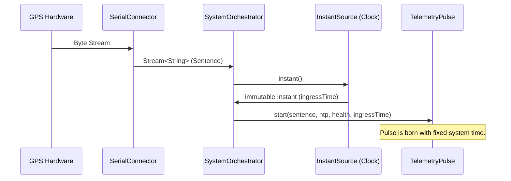

# Phase 8 Design: The Chrono Tesseract (v0.6.0)

**Objective:** Decouple time-awareness from the functional pipeline to enable deterministic drift/jitter math and hermetic testing.

## 🏛️ Architectural Model: Orchestrator-Centric Edge Stamping

To maintain the project's mandate for pure functional domain models, we will avoid injecting a stateful `Clock` or `InstantSource` into the lower-level parsers or records. Instead, the `SystemOrchestrator` will act as the system's temporal gateway.

### 1. The Edge Timestamp
The exact moment a complete NMEA sentence is emitted from the `SerialConnector` stream, the `SystemOrchestrator` will capture the system time via a decoupled `InstantSource`. This static value, `ingressTime`, will be immutable and passed down the pipeline inside the `TelemetryPulse`.

### 2. Benefits of Edge Stamping
*   **Precision:** Captures the moment of arrival, which is the most critical metric for calculating latency against the GPS authority.
*   **Purity:** Domain models (`GpsData`, `NmeaParser`) remain 100% pure; they do not perform side-effect clock lookups.
*   **Determinism:** By injecting a `Clock.fixed()` into the Orchestrator, the entire pipeline becomes 100% predictable for math verification.

### 3. Drift Verification Math (Preview for Phase 9)
By capturing `ingressTime` (System Time) and comparing it against the `utcTime` (GPS Authority) and the `referenceTime` (NTP Authority), we can calculate the drift:

$$Drift_{System} = ingressTime - AuthorityTime$$

Where $AuthorityTime$ is provided by the most accurate source available (GPS or NTP).

## 🛰️ Sequence View: Temporal Ingestion

## 🛠️ Tactical Implementation Steps

1.  **Dependency Injection:** Refactor `SystemOrchestrator` to accept `java.time.InstantSource`.
2.  **Model Evolution:** Add `final Instant ingressTime` to the `TelemetryPulse` record.
3.  **Simulation Refactor:** Cleanse `SimulationNtpProvider` of `Instant.now()`.
4.  **Hermetic Testing:** Upgrade all integration tests to use frozen clocks.
