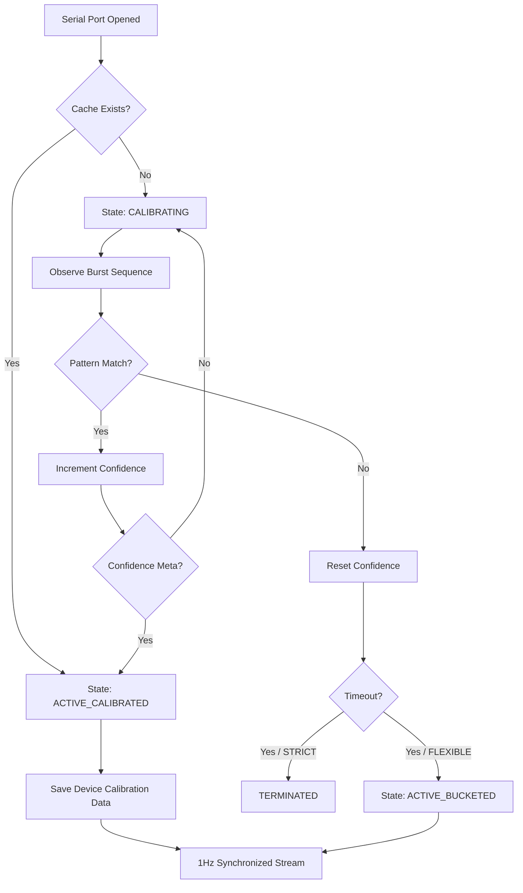

# Phase 9 Design: Phase-Locked Logic (v0.7.0)

**Objective:** Synchronize the functional 1Hz pipeline with non-deterministic hardware data bursts using a software-based Phase-Locked Loop (PLL).

## 🏛️ Smart Sync Architecture

The system transitions from a passive stream reader to an active sequence observer. This intelligence ensures zero-latency ingestion by learning exactly when a 1-second data burst ends.

### 1. Operation Modes (The Sync Policy)

| Policy | Failure Mode | Behavior | Use Case |
| :--- | :--- | :--- | :--- |
| **STRICT** | Fail-Stop | Terminates process if confidence is not reached. | Stratum 1 Disciplining. |
| **FLEXIBLE** | Fallback | Degrades to 1s latency (Temporal Bucketing). | General Telemetry / Mobile. |

### 2. The Calibration Lifecycle

### 3. Device Calibration Data (Persistence)
To optimize boot times, the system caches the identified **Sentinel** (the last sentence in a burst).
*   **Storage:** `config/calibration/[PortID].json`
*   **Payload:** `{"sentinel": "$GPZDA", "confidence": 1.0, "timestamp": "2026-05-21T..."}`

### 4. Temporal Bucketing (The Fail-Safe)
If the hardware cadence is too jittery for pattern matching, the system groups all sentences by their reported NMEA timestamp.
*   **Trigger:** Arrival of a sentence with $T + 1$.
*   **Latency:** Inherently 1.0 seconds.
*   **Stability:** High; immune to sequence changes.

## 🛠️ Data Model Evolution

### ConfluenceHealth.SyncStatus
*   `UNKNOWN`: System just booted.
*   `CALIBRATING`: Observing sequences.
*   `CALIBRATED`: Lock achieved (Zero-Latency).
*   `BUCKETED`: Fallback mode (High-Latency).
*   `TERMINATED`: Violation of Strict Policy.
