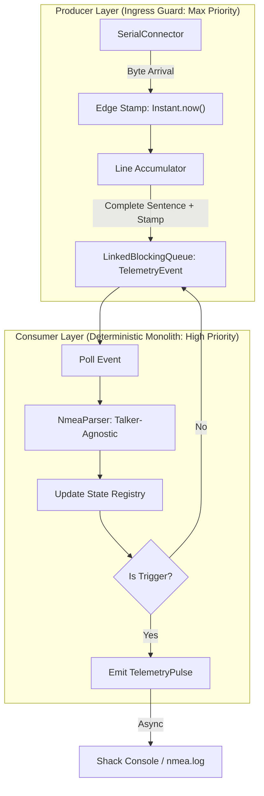

# Phase 9 Design: Reactive State Synchronization (v0.7.0)

**Objective:** Achieve Phase Lock via stateless, zero-latency ingestion of the 1Hz telemetry stream by transforming NMEA sentences into discrete temporal events.

## 🏛️ Deterministic Monolith Architecture

The system utilizes a single-consumer, high-priority pipeline to eliminate state-tearing race conditions and ensure absolute temporal fidelity.

### 1. The Deterministic Pipeline

### 2. High-Fidelity Edge Stamping
Unlike batching or multi-lane models, the system captures the "Ground Truth" timestamp at the **Producer level**.
- **T0:** First byte of a sentence arrives at the serial port.
- **T1 (The Edge):** The absolute nanosecond the `\n` character is detected by the `SerialPortDataListener`.
- **T2 (Propagation):** The `Instant` is bundled with the `String` into a `TelemetryEvent` object.
- **T3 (Execution):** Even if the consumer is delayed by GC or I/O, the pulse is emitted with the **T1 timestamp**, ensuring the reported offset is jitter-free.

### 3. State Management (The Registry)
The system maintains a single-threaded **Reactive State Registry** to prevent race conditions.
- **GGA/GNS:** Updates Altitude and Satellite Count.
- **GSV:** Updates individual Satellite SNR and Constellation data.
- **GSA:** Updates Dilution of Precision (DOP).
- **VTG:** Updates Ground Speed and Track (APRS Ready).
- **ZDA/RMC:** Triggers the Pulse, carrying the "latest" state from the registry and the **original Edge Stamp**.

### 4. Zero-Latency Logging
- **`nmea.log`:** Configured with `neverBlock=true`. This ensures the serial ingestion thread never waits for slow SD card I/O on devices like the Raspberry Pi.
- **Telemetry Heartbeat:** Only authoritative 1Hz pulses are logged to the primary shack output to minimize system noise.

## 🛠️ Data Model Evolution

### TelemetryEvent (New Internal Model)
An immutable container for high-fidelity hand-off.
- `String rawSentence`
- `Instant ingressTime`

### ConfluenceHealth.SyncStatus
- `REACTIVE_LOCK`: System is successfully triggering pulses on authoritative time sentences.
- `SIGNAL_LOSS`: No valid sentences received within the timeout.
- `SIMULATION`: Operating on synthetic data.
