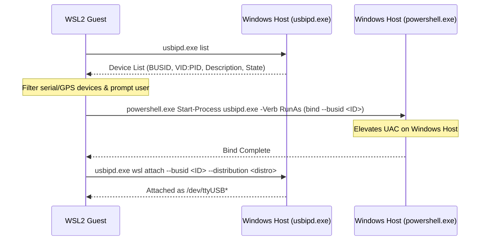

# Technical Specification: WSL2 USB Serial Port Bridge Automation Tool

This document outlines the design, execution flow, and user experience for the `wsl-usb-bridge` tool. The utility allows a developer running inside a WSL2 guest to query its hosting Windows OS, discover serial/GPS devices, elevate permissions on the host, and attach the target device, completely agnostic of hostnames or network IP configurations.

---

## 1. Objectives & Requirements

1.  **Agnostic Execution**: The script runs entirely inside WSL2 (Bash/Python) and is fully hostname-agnostic. It communicates with the local host at runtime via WSL's native interop layer (`/init`) to invoke `usbipd.exe` and `powershell.exe` without hardcoding hostnames, local domain names, or IP addresses.
2.  **GPS/Serial Discovery**: Queries the host system for USB devices, filters out non-serial components, and identifies high-probability GPS receivers (e.g., matching VID/PID or device strings like `u-blox`, `Prolific`, `Silicon Labs`).
3.  **Self-Elevation (UAC Hook)**: Triggers the Windows User Account Control (UAC) elevation prompt automatically from WSL2 when running the host-level `usbipd bind` command (which requires host Administrator privileges).
4.  **Auto-Target Current Distro**: Automatically identifies the active WSL distribution name (`$WSL_DISTRO_NAME`) and attaches the device directly to it.
5.  **Temporary User-Space Mapping Lifecycle**: Supports clean detachment and unbinding of devices (e.g., via `unbind` / `detach` subcommands) to immediately release host-level COM ports back to Windows when development completes.
6.  **SDLC Fault Testing / Disconnect Injection**: Supports script-driven detachment or simulated port absence to allow testing of the application's auto-discovery logic, recovery watchdog, and failover behavior.

---

## 2. Architecture & Execution Flow



---

## 3. Technical Design & Phase Details

### Phase 1: Host Device Query & Parsing
The tool invokes the host command parser from inside WSL2:
```bash
# Execute the Windows binary and query USB devices
devices=$(usbipd.exe list)
```
The script will parse the stdout table, mapping columns:
*   `BUSID`
*   `VID:PID`
*   `DEVICE` (Description)
*   `STATE` (`Not shared` or `Shared` or `Attached`)

### Phase 2: Heuristic Filtering
The tool will match the `DEVICE` column against a list of known GPS/UART bridge manufacturers:
*   `1546` (u-blox)
*   `067b` (Prolific)
*   `10c4` (Silicon Labs CP210x)
*   `1a86` (WCH CH340/CH341)
*   `0403` (FTDI)

### Phase 3: Elevating Administrator Permissions (UAC Hook)
Binding a device to `usbipd` (`usbipd bind`) requires Administrator privileges on the Windows host. To prevent the developer from having to manually open an elevated PowerShell window on Windows, the WSL2 script triggers UAC elevation using the Windows shell host:
```bash
powershell.exe -Command "Start-Process usbipd.exe -ArgumentList 'bind --busid $BUSID' -Verb RunAs -WindowStyle Hidden"
```
This forces Windows to display the native UAC prompt. Once approved, control returns to the WSL2 script.

### Phase 4: Attaching to WSL2 Distro
The script obtains the local distro name:
```bash
DISTRO=$WSL_DISTRO_NAME
```
Then runs the attachment command on the host:
```bash
usbipd.exe wsl attach --busid $BUSID --distribution $DISTRO
```

### Phase 5: Guest Interface Verification & Port Mapping Output
Upon sending the attach request to the host, the guest system polls `/dev/ttyUSB*` and `/dev/ttyACM*` devices for 1.5 seconds:
1.  **Poll TTY Nodes:** Monitors the output of `ls -1 /dev/ttyUSB* /dev/ttyACM* 2>/dev/tty` or inspects `dmesg | tail -n 15`.
2.  **Verify Mount:** Resolves the exact newly created serial interface node (e.g., `/dev/ttyUSB0`).
3.  **Confirm to Developer:** Prints a precise, copy-pasteable configuration key-value pair:
    ```text
    serial.port=/dev/ttyUSB0
    ```

---

## 4. User Interaction Model

1.  **Boot Script:** Developer runs `./scripts/wsl-usb-bridge.sh`.
2.  **Display Table:** The script prints identified serial devices:
    ```text
    --- 📡 WSL2 USB GPS Bridge Tool ---
    Checking Windows host for serial devices...
    
    [1] BUSID: 9-4  | Device: USB Serial Device (COM8) [u-blox] - Not shared
    [2] BUSID: 12-3 | Device: USB Serial Device (COM3) [u-blox] - Shared
    
    Select a device number to attach to WSL2 (or 'q' to quit): 
    ```
3.  **UAC Request:** If the device is `Not shared`, the UAC prompt flashes on the Windows taskbar.
4.  **Confirmation:** The script monitors the attachment and confirms:
    ```text
    ✅ Device bound successfully.
    🔗 Attaching BUSID 9-4 to WSL2 distro 'Ubuntu'...
    🎉 Device attached successfully as /dev/ttyUSB0.
    ```
5.  **Release Option:** Developer runs `./scripts/wsl-usb-bridge.sh release` or `--release`.
    *   Triggers detachment: `usbipd.exe detach --busid <BUSID>`
    *   Triggers unbinding: `powershell.exe Start-Process usbipd.exe -ArgumentList 'unbind --busid <BUSID>' -Verb RunAs`
    *   Restores the vendor device drivers on Windows host (COM port immediately returned to host services).

---

## 5. SDLC Testing Scenarios & Fault Injection

To support rigorous testing of the `qtr-qth` hub, the bridge tool supports intentional script-driven failures:

### Scenario A: Simulate Port Disconnection Mid-Run
*   **Action:** While the Java engine is running and consuming telemetry, run:
    ```bash
    ./scripts/wsl-usb-bridge.sh simulate-disconnect --busid <BUSID>
    ```
*   **Result:** Under the hood, this executes `usbipd.exe detach` on the host. 
*   **Validation:** Verify that the `SystemOrchestrator` detects the interrupt within the `5` second window, logs the `SIGNAL LOSS DETECTED` warning, neutralizes the port wrapper, and enters the `Adaptive Recovery` retry state gracefully without crash or thread leakage.

### Scenario B: Simulate Missing Port / Scan Failures
*   **Action:** Unbind/detach all devices, and start the engine in hardware mode:
    ```bash
    ./scripts/wsl-usb-bridge.sh release
    ./gradlew run
    ```
*   **Result:** The application scanner should fail to identify a likely GPS receiver.
*   **Validation:** Confirm the system logs the `STRATUM 0 DISCOVERY FAILURE` warn block, automatically triggers the fallback state machine, and enters `SIMULATION_LOCK` mode (pulling fake sentences from `simulation/gps_sim.nmea`) to sustain the telemetry river.

---

## 6. Security Boundaries, Dependencies, & Error Mitigation

To qualify as a production-ready Technical Requirement Document (TRD), the bridge utility conforms to the following system constraints:

### A. Dependencies & Version Bounds
*   **Host System:** Windows 10/11 with WSL2 enabled.
*   **Host Dependency:** `usbipd-win` (Version `4.0.0` or higher recommended).
*   **Guest System:** GNU/Linux distribution running in WSL2 with `usbip-wsl` tools installed (`sudo apt install usbip-wsl`).

### B. Error Mitigation & Resiliency
1.  **Missing Host Binary:**
    *   *Detection:* The script checks for the existence of `usbipd.exe` in the host search paths before querying.
    *   *Mitigation:* If missing, the script halts and outputs a clear troubleshooting guide with the official installation link:
        `https://github.com/dorssel/usbipd-win/releases`
2.  **UAC Elevation Refusal:**
    *   *Detection:* The script traps PowerShell's exit codes when running elevated commands.
    *   *Mitigation:* If the user declines the Windows UAC elevation popup, the script aborts the bind cycle gracefully, prints `⚠️ Host binding was declined by user`, and exits to prevent looping prompts.
3.  **Failed Attaching (Device in Use):**
    *   *Detection:* Captures host error stdout from `usbipd.exe wsl attach`.
    *   *Mitigation:* Displays the specific host error (e.g. device already attached, or driver mismatch) and suggests running `./scripts/wsl-usb-bridge.sh release` to reset the interface state.

### C. Security Boundaries
*   **Privilege Isolation:** Administrator privileges are only invoked for the host-side `usbipd bind` and `unbind` driver registration tasks. The guest script executes entirely under local user space, avoiding any root-level escalation or external network exposure.

